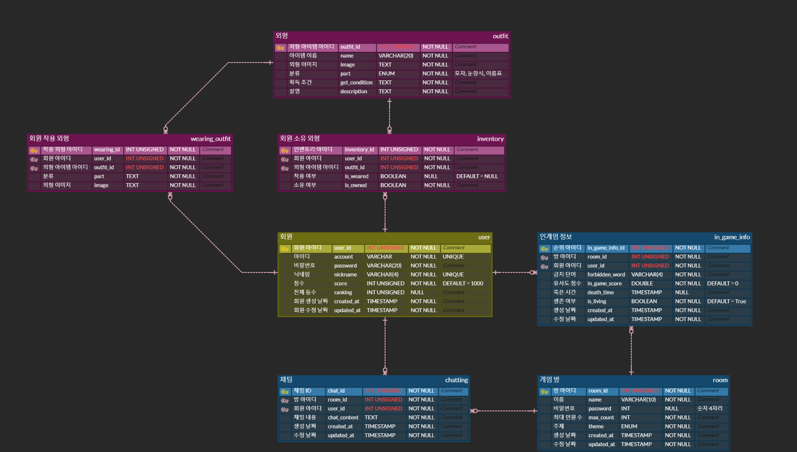
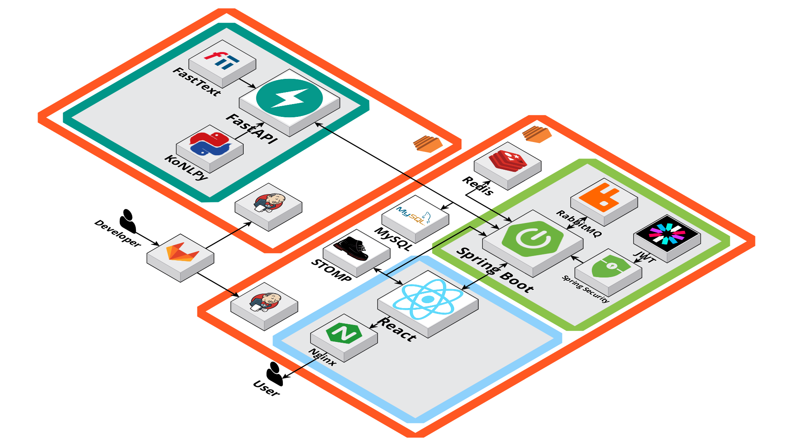

# Weeting (위험한 채팅)

## ✨ 프로젝트 개요

### 1. 프로젝트명

위팅(Weeting)

### 2. 프로젝트 기간

2024.04.08 ~ 2024.05.20(6주)

### 3. 프로젝트 주제

친목 도모용 채팅 게임 서비스

### 4. 프로젝트 주요 기능

#### 👦 회원

- 로그인 / 로그아웃
  - Spring Security + JWT를 통한 토큰을 통한 세션 관리 기능
  - 액세스 토큰 만료시 리프레쉬 토큰을 이용한 토큰 재발급 기능
- 회원 탈퇴
  - 일반 회원가입 한 유저, 소셜 로그인을 통한 유저 회원 탈퇴 기능 제공

#### 📝 랭킹 및 접속 유저 리스트 표시

- 현재 접속 중인 유저를 확인 가능
- 접속 중인 유저는 레이팅 순으로 표시

#### 🧐 채팅방

- 방 조회
  - 생성된 모든 방의 목록을 조회
  - 공개 / 비공개 구분하여 조회 가능
  - 전체 / 일반 / 랭크 모드를 선택하여 필터링하여 조회 가능
  - 방 이름을 검색하여 조회 가능
- 방 생성
  - 생성 시, 방 이름 / 공개 여부 / 인원 수 설정 가능
- 방 참가
  - 비밀번호가 설정된 방인 경우에는 비밀번호를 입력하여 입장 가능
- 방 나가기
  - 방을 나갈 시, 방 목록 조회 페이지로 이동
  - 모든 참가자가 방을 나갈 시 방이 삭제된다.

#### ✔️ 게임 준비

- Ready 기능
  - 참가자가 준비 완료 상태로 전환
- 게임 시작
  - 모든 인원이 준비 완료 상태가 되면, 방장이 게임 시작 가능

#### 💬 게임 진행

- 금칙어 선정
  - 금칙어 선정에 용이하도록 미리 선정된 주제 중 랜덤으로 1개 제시
  - 단일 자음, 모음이 금칙어에 포함되어 있는 경우 제한
  - 타이머 내에 금지어를 입력하지 못할 시 탈락
  - 금칙어 선정이 모두 완료될 시, 나를 제외한 다른 사람들의 금칙어를 화면에 표시
- 채팅
  - 채팅 내용 중 금지어와 유사한 단어가 포함될 경우, 가장 유사도가 높은 점수를 가진 단어와 해당 단어의 유사도 점수를 표시
  - 유사도 점수에 따라 실시간으로 게임 순위 변화 표시
  - 채팅 내용 중 선정된 금칙어가 포함될 경우 게임 탈락
  - 탈락한 유저들도 채팅이 가능하나, 탈락하지 않은 유저들은 탈락한 유저들의 채팅을 보지 못함.

#### 📝 게임 종료

- 게임 종료
  - 최후의 1인 혹은 제한 시간이 모두 지났을 시 게임이 종료
  - 게임 내 랭킹을 모달창으로 표시
  - 랭킹 모드일 시, 게임 내 랭킹에 따라 플레이어의 레이팅이 변화

#### 🤡 커스텀 기능

- 캐릭터 커스텀
  - 본인의 캐릭터를 취향에 맞게 커스텀할 수 있는 기능 제공
  - 상위 랭킹 유저들에게 제공되는 특별한 커스텀을 통해 성취감 제공

### ✏️ 기술 특이점

#### 자연어 처리(NLP)

- 자연어 처리 기술을 활용하여 문장 내 단어 형태소 분석 및 처리
- kospacing을 활용하여 문장 내 띄어쓰기가 안 된 단어에 대해 띄어쓰기 처리

#### 단어 간 의미 유사도 계산

- Fasttext Model을 활용하여 두 단어 간 의미적인 유사도를 계산
  - 해당 단어와 유사도 값이 높은 상위 2000개의 단어 추출
  - 해당 단어가 포함된 유사 단어, 한국어가 아닌 유사 단어 제거 등 별도의 예외 처리를 통한 정제 과정 포함

#### Spirng security + JWT 기술
- Spring security + JWT을 활용하여 로그인한 사용자의 인증 및 사용자의 요청이 서버에 도달할 때마다 검증되어 해당 요청이 유효한 사용자로부터 온 것임을 보증 
- 모든 인바운드 요청에 대해 Security JwtAuthenticationFilter를 통해 JWT가 유효한지 검사, 유효한 경우 사용자의 인증 정보를 SecurityContext에 저장

#### WebSocket with STOMP & RabbitMQ

- WebSocket 연결을 통해 서버와 클라이언트 간의 지속적이고 실시간의 양방향 통신 채널을 구축하였으며, STOMP 프로토콜을 사용하여 이러한 통신을 구조화하고 메시지 교환을 명확하게 관리
- RabbitMQ 메시지 브로커를 도입하여 메시지를 효율적으로 라우팅하고 분산 처리함으로써, 시스템 전반의 메시지 전달 유연성과 확장성을 향상

### ✨ 서비스 화면

### 🚀 기술 스택

#### Front-End

- React `18.3.1`
- Typescript `5.2.2`
- axios
- Recoil
- CSS.module
- React-router-dom `6.22.3`
- STOMP
- WebSocket
- Vite
- ESLint
- Prettier

#### Back-End

- Java `17.0.9`
- Spring Boot `3.2.3`
- Lombok
- openAPI `(Swagger 3.0)`
- Gradle `8.5`
- Spring Security
- JWT
- Spring Data JPA
- QueryDSL
- WebSocket
- STOMP
- RabbitMQ
- Python `3.8.10`
- FastAPI `0.110.0`

#### DB

- MySQL `8.0.36`
- Redis

#### Infra

- AWS EC2
- Ubuntu `20.04.6 LTS`
- Nginx
- Docker `25.0.4`
- Docker Compose
- Jenkins `2.455`

#### Data

- aioredis `2.0.1`
- konlpy `0.6.0`
- pydantic `2.7.1`
- requests `2.31.0`
- uvicorn `0.28.0`
- webdriver-manager `4.0.1`
- websockets `12.0`
- fasttext

### 프로젝트 노션 페이지

[프로젝트 노션 페이지](https://www.notion.so/057f88f084904ae388523c15be87b932)

### 기능 명세

[기능 명세](https://www.notion.so/b03883ab38254e569dfd168ace1088e1?v=3633cb1eb3ad453f91e5201c1d1917ed&pvs=4)

### API 명세

[API 명세](https://www.notion.so/08a6e768b6274301a5ceab008c3876ff?v=59b9040edc72426495b5ea1af06f6ae8&pvs=4)

### ERD

### System Architecture

### 역할 분담

| 이름   | 역할               | 업무                                                                       |
| ------ | ------------------ | -------------------------------------------------------------------------- |
| 전승혜 | 팀장, FE            |  |
| 강지수 | FE 리더             |  |
| 김재훈 | BE, INFRA          |  |
| 안준선 | FE                 |  |
| 이지호 | BE 리더, Data       | CI/CD(Data Server), 채팅 데이터 전처리, 한국어 형태소 분석, 단어 의미 유사도 계산 |
| 황인범 | BE                 |  |